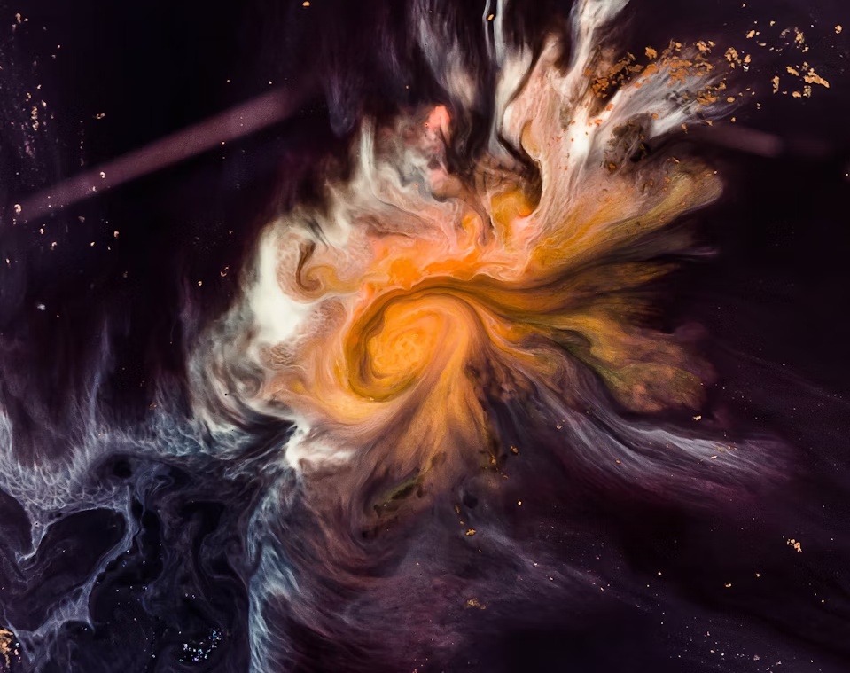

# Descrição do cenário
Num futuro de expansão estelar e tensão ideológica, a abertura do [[Portal de Oráxis]] — uma anomalia cósmica reverenciada por uns e explorada por outros — desencadeia uma nova era de conflitos entre corporações, facções religiosas, rebeldes e espécies alienígenas. O [[Conglomerado Polux]] busca riquezas além do portal através da [[Guilda dos Exploradores]], desafiando os dogmas da [[Ordem de Oráxis]], que o considera sagrado. Enquanto isso, o [[Sindicato do Véu Sombrio]] lucra nas sombras, os misteriosos [[Lar’mir]] se infiltram em defesa de seus ecossistemas, e o [[Último Voto]] resiste em nome dos povos oprimidos. Neste cenário, alianças são frágeis, fé e ciência colidem, e o destino da galáxia se desenha nas estrelas.

# [[Diagrama das Facções.canvas|Diagrama das Facções]]
# Raças
 - [[Faeren]]
 - [[Lar’mir]]
 - [[Murnak]]
 - [[Zex]]

# Mapa do Setor Galáctico
![[MapaSetor.png]]

foto do banner por Joel Filipe

